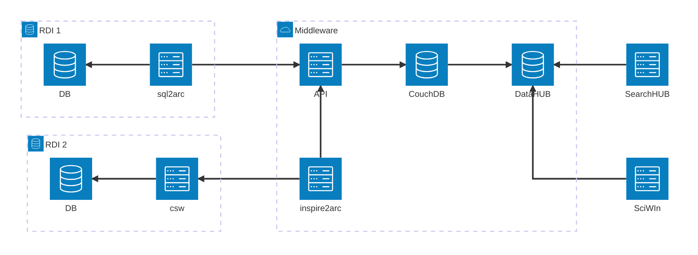

# Architecture

```mermaid
architecture-beta

    group rdi1(database)[RDI 1]
    service rdi1db(database)[DB] in rdi1
    service sql2arc(server)[sql2arc] in rdi1

    group rdi2(database)[RDI 2]
    service rdi2db(database)[DB] in rdi2
    service csw(server)[csw] in rdi2

    group middleware(cloud)[Middleware]
    service api(server)[API] in middleware
    service db(database)[CouchDB] in middleware
    service git(database)[DataHUB] in middleware
    service inspire2arc(server)[inspire2arc] in middleware

    service searchhub(server)[SearchHUB]
    service sciwin(server)[SciWIn]

    api:R --> L:db
    db:R --> L:git
    sql2arc:L --> R:rdi1db
    sql2arc:R --> L:api
    csw:L --> R:rdi2db
    inspire2arc:T --> B:api
    inspire2arc:L --> R:csw
    searchhub:L --> R:git
    sciwin:L --> B:git
```
